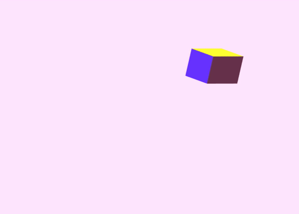

Based off teachings from [Dr. Wayne Brown](http://learnwebgl.brown37.net/index.html) and tutorials from [IndigoCS](https://www.youtube.com/watch?v=kB0ZVUrI4Aw&list=PLjcVFFANLS5zH_PeKC6I8p0Pt1hzph_rt)

The intention of these experiments was for me for learn the theory behind WebGL. I used both resources as reference but tried my best to not follow along and code on my own. I'm currently in the process of making my code better...

View Demo Here:
[Demo](https://graciexia8.github.io/webgl_learning/)

Note* to develop locally on WebGL, I had to embed vertex and fragment shaders within the HTML. I should learn to setup a local webserver...

Some Samples:

